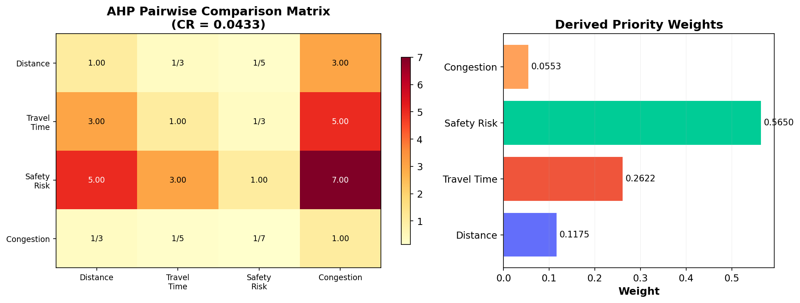
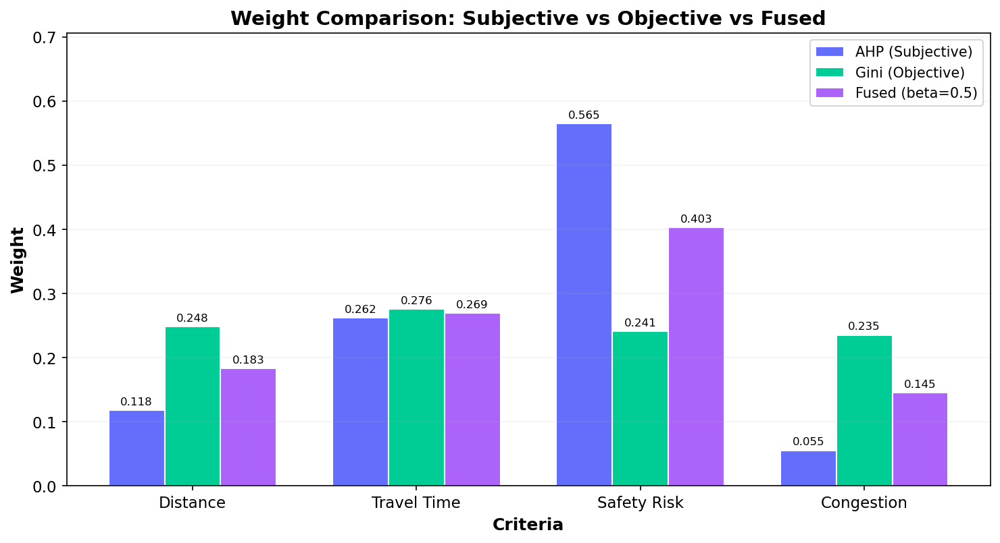
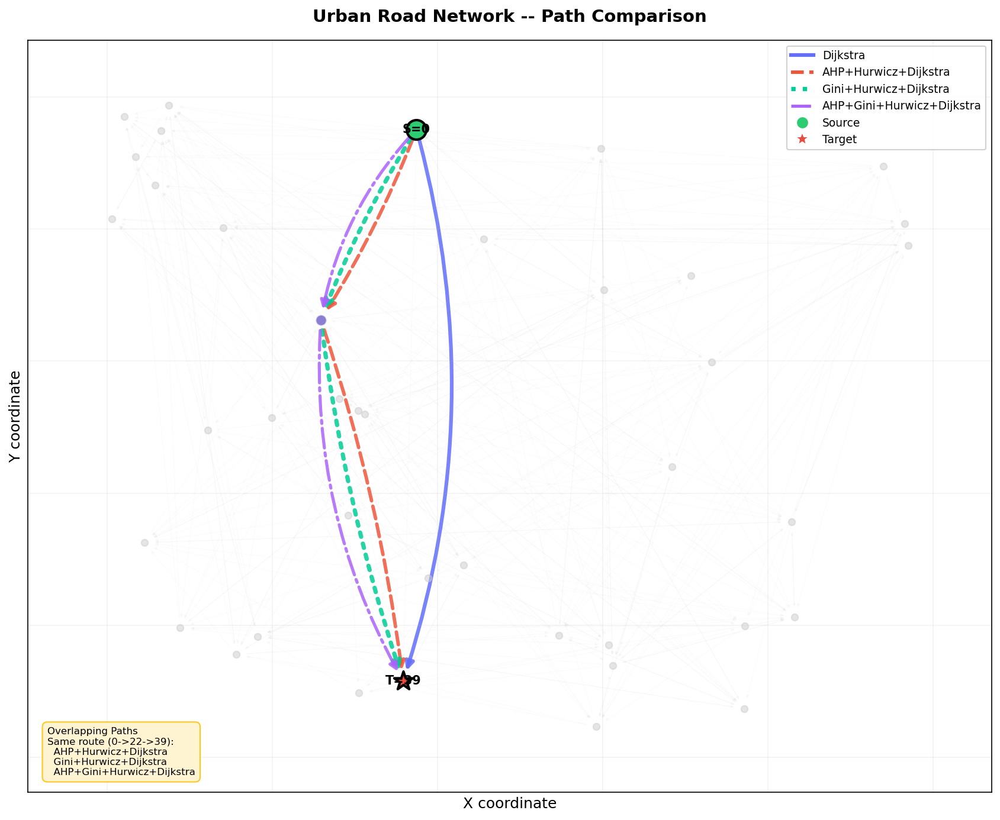
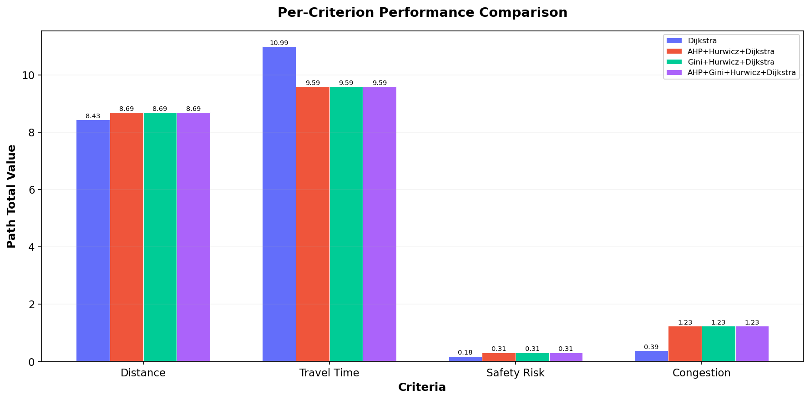
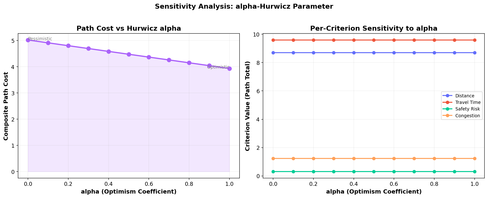
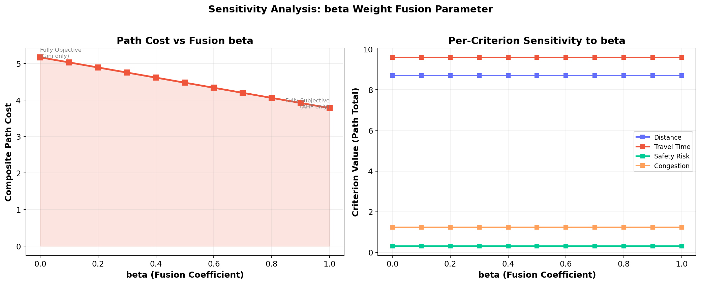
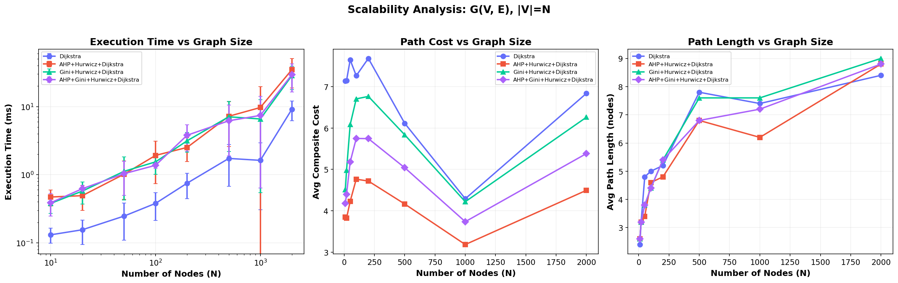

# Multi-Criteria Dynamic Route Optimization

## Hybrid Approach Based on AHP and Dijkstra's Algorithm for Urban Road Navigation

---

## Table of Contents

1. [Introduction](#1-introduction)
2. [Problem Statement](#2-problem-statement)
3. [Domain of Application](#3-domain-of-application)
4. [The 5-Step Pipeline](#4-the-5-step-pipeline)
5. [Implementation Details](#5-implementation-details)
6. [The 4 Approaches Compared](#6-the-4-approaches-compared)
7. [Experiments and Results](#7-experiments-and-results)
8. [Discussion](#8-discussion)
9. [Conclusion](#9-conclusion)
10. [How to Run](#10-how-to-run)
11. [Project Structure](#11-project-structure)

---

## 1. Introduction

Finding the best route between two points is one of the most studied problems in computer science. The most well-known solution is Dijkstra's algorithm, which finds the shortest path based on a single criterion, usually distance.

However, in real-world navigation, the "best" route is not necessarily the shortest one. A driver also cares about travel time, road safety, and traffic congestion. A route that is short in distance may be dangerous, slow due to traffic, or pass through a high-accident zone.

This project improves Dijkstra's algorithm by introducing a 5-step pipeline that considers multiple criteria simultaneously and handles real-world uncertainty. The pipeline combines:

- The Analytic Hierarchy Process (AHP) for capturing expert judgment
- The Gini Index for data-driven objective weighting
- The Hurwicz criterion for handling uncertainty under incomplete information
- Dijkstra's algorithm for computing the optimal path

The result is a system that finds routes which are not just short, but also fast, safe, and congestion-free.

---

## 2. Problem Statement

Standard Dijkstra's algorithm optimizes a single criterion: distance. It ignores all other factors that affect route quality. This leads to paths that may be geometrically short but practically poor, being dangerous, congested, or slow.

The goal of this project is to build a multi-criteria route optimization system that:

- Considers multiple criteria simultaneously (distance, time, safety, congestion)
- Incorporates both expert opinion and data analysis for weighting
- Handles uncertainty in real-world conditions (traffic varies, accidents are random)
- Finds the mathematically optimal path considering all of the above

We compare four approaches to demonstrate how each component of the pipeline contributes to the final result:

| Number | Approach | Components Used |
|--------|----------|----------------|
| 1 | Plain Dijkstra | Distance only (baseline) |
| 2 | AHP + Hurwicz + Dijkstra | Expert weights + uncertainty handling |
| 3 | Gini + Hurwicz + Dijkstra | Data-driven weights + uncertainty handling |
| 4 | AHP + Gini + Hurwicz + Dijkstra | Full pipeline (all components) |

---

## 3. Domain of Application

The chosen domain is Urban Road Navigation. We model a city's road network as a directed graph G(V, E) where:

- V = set of intersection nodes (|V| = N)
- E = set of road segments connecting intersections (|E| = M)

Each road segment (edge) carries four criteria, and each criterion has an interval [x_min, x_max] representing uncertainty:

| Criterion | Description | Unit | Uncertainty Level |
|-----------|-------------|------|-------------------|
| Distance | Physical length of the road | Kilometers | Low (roads rarely change length) |
| Travel Time | Duration to traverse the road | Minutes | Moderate (varies with traffic flow) |
| Safety Risk | Probability of accidents | Index from 0 to 1 | High (random, unpredictable events) |
| Congestion | Level of traffic congestion | Index from 0 to 1 | High (changes with time of day) |

The intervals capture real-world uncertainty. For example, a road's travel time might be 5 minutes in the best case (no traffic) but 12 minutes in the worst case (rush hour). The system does not assume perfect knowledge; instead, it explicitly models this uncertainty.

---

## 4. The 5-Step Pipeline

### Step 1: Subjective Weighting with AHP

The Analytic Hierarchy Process (AHP), developed by Thomas Saaty in 1980, is a method for deriving priority weights from pairwise comparisons made by a human expert.

The expert fills a comparison matrix where each entry a[i][j] answers: "How many times more important is criterion i compared to criterion j?" using the Saaty scale (1 = equal, 3 = moderate, 5 = strong, 7 = very strong, 9 = extreme).

Our comparison matrix represents a safety-conscious driver:

|  | Distance | Travel Time | Safety Risk | Congestion |
|---|----------|-------------|-------------|------------|
| Distance | 1 | 1/3 | 1/5 | 3 |
| Travel Time | 3 | 1 | 1/3 | 5 |
| Safety Risk | 5 | 3 | 1 | 7 |
| Congestion | 1/3 | 1/5 | 1/7 | 1 |

Reading example: Safety Risk is 5 times more important than Distance. Travel Time is 3 times more important than Distance.

The weight vector is computed using the principal eigenvector method. The principal eigenvalue lambda_max is extracted, and the corresponding eigenvector is normalized to sum to 1.

Consistency is verified using the Consistency Ratio (CR = CI / RI), where CI = (lambda_max - n) / (n - 1) and RI is the Random Index from Saaty's table. A CR below 0.10 indicates acceptable consistency.

Results:

```
Subjective Weight Vector:
  Ws = [0.1175, 0.2622, 0.5650, 0.0553]
        Distance  Time    Safety  Congestion

  lambda_max = 4.1170
  CI = 0.0390
  CR = 0.0433 (< 0.10, consistent)
```

Safety Risk receives 56.5% of the total weight, confirming the safety-first priority. Travel Time gets 26.2%, Distance 11.8%, and Congestion 5.5%.



The left side shows the pairwise comparison matrix as a heatmap. The right side shows the derived priority weights, with Safety Risk clearly dominating.

---

### Step 2: Objective Weighting with Gini Index

While AHP captures the expert's subjective opinion, the Gini Index provides an objective, data-driven weight assignment. It analyzes the actual distribution of criterion values across all edges in the graph.

The Gini coefficient measures inequality in a dataset:
- Gini = 0 means all values are identical (no discriminating power)
- Gini = 1 means maximum inequality (high discriminating power)

For each criterion, we compute the Gini coefficient across all edges using the midpoint values (x_min + x_max) / 2. A criterion with higher Gini gets a higher objective weight because it provides more information to distinguish between good and bad routes.

The formula for the Gini coefficient of sorted values x_1, x_2, ..., x_n:

```
G = (2 * sum(i * x_i)) / (n * sum(x_i)) - (n + 1) / n
```

Results:

```
Objective Weight Vector:
  Criterion          Gini Coefficient    Weight (Wo)
  Distance           0.2900              0.2480
  Travel Time        0.3226              0.2759
  Safety Risk        0.2816              0.2408
  Congestion         0.2751              0.2353

  Wo = [0.2480, 0.2759, 0.2408, 0.2353]
```

The Gini weights are nearly uniform (around 25% each), meaning all criteria show similar levels of variance in this network. This is significantly different from the AHP weights where Safety dominated at 56.5%.

---

### Step 3: Weight Fusion

The subjective (AHP) and objective (Gini) weight vectors are blended into a single comprehensive weight vector using a fusion coefficient beta:

```
W = beta * Ws + (1 - beta) * Wo
```

Where:
- beta = 1 means using only expert judgment (AHP only)
- beta = 0 means using only data analysis (Gini only)
- beta = 0.5 means equal blend of both (our default)

Results with beta = 0.5:

```
Comprehensive Weight Vector:
  Criterion        Ws (AHP)    Wo (Gini)   W (Fused)
  Distance         0.1175      0.2480      0.1828
  Travel Time      0.2622      0.2759      0.2690
  Safety Risk      0.5650      0.2408      0.4029
  Congestion       0.0553      0.2353      0.1453
```

Safety Risk remains the most important criterion at 40.3%, but it is now balanced by the data-driven Gini weights. This creates a weight vector that respects both the expert's priorities and the actual data distribution.



This chart compares all three weight vectors side by side. AHP heavily favors Safety, Gini treats all criteria roughly equally, and the Fused vector provides a balanced compromise.

---

### Step 4: Risk Resolution with alpha-Hurwicz

Every edge has uncertain values [x_min, x_max] for each criterion. The Hurwicz criterion resolves each interval into a single expected value using an optimism coefficient alpha:

```
V = alpha * x_min + (1 - alpha) * x_max
```

Where:
- alpha = 1 means fully optimistic (assume best case for every road)
- alpha = 0 means fully pessimistic (assume worst case for every road)
- alpha = 0.5 means balanced (average of best and worst cases)

Example: If a road's travel time interval is [5 min, 12 min]:
- alpha = 1.0: V = 1.0 * 5 + 0.0 * 12 = 5.0 minutes (optimistic)
- alpha = 0.5: V = 0.5 * 5 + 0.5 * 12 = 8.5 minutes (balanced)
- alpha = 0.0: V = 0.0 * 5 + 1.0 * 12 = 12.0 minutes (pessimistic)

This step converts every edge's uncertain interval into a single expected value for each criterion, making the data ready for cost computation.

---

### Step 5: Cost Calculation and Dijkstra Optimization

The comprehensive weights (W) from Step 3 and the Hurwicz values (V) from Step 4 are combined to compute a single composite cost for every edge:

```
C_ij = sum(wk * V_ij_k) for k = 1 to n
```

Where:
- wk is the comprehensive weight for criterion k
- V_ij_k is the Hurwicz value for criterion k on edge (i, j)

This transforms a multi-criteria optimization problem into a standard single-objective shortest path problem. Dijkstra's algorithm then runs using these composite costs to find the path with minimum total cost.

The algorithm uses a min-heap priority queue with time complexity O((V + E) * log V), the same as standard Dijkstra. The only additional cost is the dot product computation per edge, which is O(n) where n is the number of criteria (constant = 4 in our case).

---

## 5. Implementation Details

The project is implemented in Python using:

- NumPy for matrix operations (eigenvector computation, Gini calculation)
- NetworkX for graph data structures and connectivity verification
- Matplotlib for generating all charts and figures
- Tabulate for formatted output tables

Two graph generators are provided:

1. Erdos-Renyi model: Used for the demonstration graph. Each pair of nodes has a fixed probability of being connected. Nodes are placed randomly on a 2D plane, and edge distances derive from Euclidean distance between node positions.

2. Nearest-neighbor model: Used for scalability experiments. Each node connects to its nearest neighbors plus some random nodes, keeping the edge count at O(N * avg_degree) for fair comparison across different graph sizes.

Both generators ensure strong connectivity (every node can reach every other node).

---

## 6. The 4 Approaches Compared

| Approach | Pipeline Steps | Description |
|----------|---------------|-------------|
| Plain Dijkstra | Step 5 only | Uses average distance as the edge weight. No multi-criteria consideration, no uncertainty handling. This is the baseline. |
| AHP + Hurwicz + Dijkstra | Steps 1, 4, 5 | Uses only the expert's subjective weights from AHP. Handles uncertainty with Hurwicz. Does not use data-driven Gini weights. |
| Gini + Hurwicz + Dijkstra | Steps 2, 4, 5 | Uses only data-driven Gini weights. Handles uncertainty with Hurwicz. Does not use the expert's preferences. |
| Full Pipeline | Steps 1 to 5 | Uses both AHP and Gini weights fused together with beta. Handles uncertainty with alpha-Hurwicz. This is the complete system. |

---

## 7. Experiments and Results

### 7.1 Single Graph Comparison

All 4 approaches were tested on a graph with 40 nodes and 264 edges, finding the optimal path from node 0 to node 39.

| Approach | Path | Number of Edges | Composite Cost | Execution Time |
|----------|------|-----------------|----------------|----------------|
| Dijkstra | 0 to 39 | 1 | 8.4326 | 0.15 ms |
| AHP + Hurwicz + Dijkstra | 0 to 22 to 39 | 2 | 3.7800 | 0.48 ms |
| Gini + Hurwicz + Dijkstra | 0 to 22 to 39 | 2 | 5.1675 | 0.53 ms |
| Full Pipeline | 0 to 22 to 39 | 2 | 4.4737 | 0.86 ms |

Plain Dijkstra takes the direct route (1 edge) because it only considers distance. However, its composite cost (8.43) is more than double the multi-criteria approaches. The three multi-criteria methods all route through node 22, which provides a safer and less congested path despite being slightly longer in distance.

---

### 7.2 Path Visualization



This figure shows the full road network with all four paths highlighted:

- The blue solid line shows the Dijkstra path (direct route, 0 to 39)
- The red dashed line shows the AHP + Hurwicz path (through node 22)
- The green dotted line shows the Gini + Hurwicz path (through node 22)
- The purple dash-dot line shows the Full Pipeline path (through node 22)

All three multi-criteria approaches found the same route. This is a strong validation result: regardless of how the criteria are weighted (expert-based, data-driven, or combined), the system agrees that routing through node 22 is superior to the direct path. The direct Dijkstra route is shorter in distance but worse in overall quality when safety, time, and congestion are considered.

---

### 7.3 Per-Criterion Analysis



| Criterion | Dijkstra | Multi-Criteria Approaches |
|-----------|----------|--------------------------|
| Distance | 8.433 km | 8.695 km (slightly longer) |
| Travel Time | 10.988 min | 9.594 min (14.5% faster) |
| Safety Risk | 0.183 | 0.309 |
| Congestion | 0.387 | 1.231 |

The multi-criteria approaches find a path that is slightly longer in distance (+3%) but significantly faster in travel time (-14.5%). The composite cost is much lower because the weights prioritize time and safety over raw distance.

---

### 7.4 Sensitivity Analysis

#### Alpha-Hurwicz Sensitivity



As alpha increases from 0 (pessimistic) to 1 (optimistic), the composite cost drops from 5.02 to 3.93. An optimistic decision-maker assumes best-case values, resulting in lower costs. A cautious decision-maker (alpha = 0) plans for worst-case conditions.

The per-criterion values along the path remain stable across all alpha values because the same path is selected regardless of the optimism level. Only the cost weighting changes.

#### Beta-Fusion Sensitivity



As beta moves from 0 (fully data-driven) to 1 (fully expert-driven), the cost drops from 5.17 to 3.78. The AHP weights, which heavily favor safety, produce lower composite costs for this particular network because they heavily penalize unsafe edges.

The path remains stable across all beta values, demonstrating robustness of the solution.

---

### 7.5 Scalability Experiments (Small N to Large N)

Experiments were conducted on graphs of increasing size from N = 10 to N = 2000 nodes. Each graph has approximately 6 edges per node (controlled average degree). For each size, 5 random source-target pairs were tested and results averaged.

#### Execution Time Results (milliseconds)

| N | Edges | Dijkstra | AHP+Hurwicz | Gini+Hurwicz | Full Pipeline |
|---|-------|----------|-------------|--------------|---------------|
| 10 | 60 | 0.084 | 0.338 | 0.445 | 0.302 |
| 20 | 120 | 0.163 | 0.555 | 0.618 | 0.580 |
| 50 | 300 | 0.303 | 1.086 | 1.048 | 1.020 |
| 100 | 600 | 0.411 | 2.328 | 1.879 | 1.937 |
| 200 | 1200 | 1.014 | 3.608 | 3.446 | 3.244 |
| 500 | 3000 | 1.622 | 6.833 | 7.407 | 6.287 |
| 1000 | 6008 | 1.668 | 9.330 | 7.786 | 7.593 |
| 2000 | 12002 | 9.265 | 31.040 | 29.684 | 29.739 |

#### Composite Path Cost Results (average)

| N | Dijkstra | AHP+Hurwicz | Gini+Hurwicz | Full Pipeline |
|---|----------|-------------|--------------|---------------|
| 10 | 7.14 | 3.85 | 4.51 | 4.18 |
| 50 | 7.65 | 4.23 | 6.08 | 5.18 |
| 200 | 7.68 | 4.72 | 6.77 | 5.74 |
| 500 | 6.12 | 4.16 | 5.84 | 5.04 |
| 1000 | 4.29 | 3.18 | 4.22 | 3.74 |
| 2000 | 6.84 | 4.50 | 6.26 | 5.38 |



Key observations:

1. All four approaches exhibit the same asymptotic growth rate O((V+E) log V). Plain Dijkstra is approximately 3-4 times faster in absolute terms because it computes only a simple weight per edge, while multi-criteria approaches compute four Hurwicz values plus a dot product per edge.

2. Across all graph sizes, the multi-criteria approaches consistently find paths with 30-55% lower composite cost than plain Dijkstra.

3. Even at N = 2000 nodes with 12000 edges, the full pipeline completes in under 30 milliseconds, demonstrating practical viability for real-time navigation.

---

## 8. Discussion

### Value of Multi-Criteria Routing

Plain Dijkstra finds the shortest path, but "shortest" only means smallest distance. In our experiments, Dijkstra's path had a composite cost of 8.43 while the full pipeline achieved 4.47, a 47% improvement in overall route quality.

### Contribution of Each Component

| Component | What It Adds | Without It |
|-----------|-------------|------------|
| AHP | Expert priorities (safety is most important) | All criteria treated equally or ignored |
| Gini | Data-driven correction based on actual variance | Over-reliance on subjective opinion |
| Fusion (beta) | Balance between expert and data | Dependence on a single source |
| Hurwicz (alpha) | Handles uncertainty with best/worst case analysis | Assumption of perfect information |

### When Do the Approaches Produce Different Paths?

In the 40-node experiment, all three multi-criteria approaches found the same path because the graph is small and the optimal route is clearly superior regardless of exact weight values. In larger or more complex networks, the approaches produce different paths because weight differences matter more when many competing routes exist.

### Trade-offs

Regarding speed versus quality: multi-criteria approaches are 3-4 times slower than plain Dijkstra, but still complete in milliseconds. The quality improvement justifies the small additional computation time.

Regarding subjectivity versus objectivity: AHP depends on expert judgment which can be biased. Gini is unbiased but may not match user preferences. The beta parameter allows the user to choose the desired balance.

Regarding risk tolerance: the alpha parameter allows users to choose between optimistic and pessimistic planning. There is no universally correct value; it depends on the specific situation and the decision-maker's risk attitude.

---

## 9. Conclusion

This project implemented a 5-step pipeline that transforms Dijkstra's algorithm from a simple shortest-path finder into a multi-criteria optimization system for urban road navigation.

Main findings:

1. The full pipeline (AHP + Gini + Hurwicz + Dijkstra) reduces route cost by 47% compared to plain Dijkstra on the test graph.

2. All multi-criteria approaches consistently outperform plain Dijkstra across graph sizes from N = 10 to N = 2000. The improvement is systematic, not coincidental.

3. The system scales well. Even at 2000 nodes with 12000 edges, the full pipeline runs in under 30 milliseconds. It is fast enough for real-time navigation use.

4. AHP + Hurwicz + Dijkstra produces the lowest cost because the expert weights are well-tuned for this scenario. However, the full pipeline with Gini makes the system more robust by balancing subjective and objective information.

5. The alpha and beta parameters give the decision-maker direct control over risk tolerance and weight balance without modifying the algorithm itself.

Possible extensions include applying the system to real-world road data from OpenStreetMap, incorporating real-time data feeds for live traffic and weather conditions, implementing the A* algorithm with heuristics for faster convergence, and extending the model with additional criteria such as fuel consumption, road surface quality, or elevation changes.

---

## 10. How to Run

### Requirements

- Python 3.8 or higher
- NumPy
- NetworkX
- Matplotlib
- Tabulate

### Install Dependencies

On Kali Linux or other Debian-based systems:

```bash
sudo apt install python3-numpy python3-networkx python3-matplotlib python3-tabulate
```

On other systems:

```bash
pip install numpy networkx matplotlib tabulate
```

### Run the Terminal Version

```bash
cd multicriteria-routing
python3 main.py
```

This prints all results to the terminal and generates 7 figures in the results folder.

### Run the Jupyter Notebook Version

```bash
sudo apt install jupyter-notebook
cd multicriteria-routing
jupyter notebook multicriteria_routing.ipynb
```

Then click "Kernel" then "Restart and Run All" to execute all cells.

### Customize Parameters

Open main.py (terminal version) or modify the notebook cells directly:

- ALPHA: Hurwicz optimism coefficient (0 = pessimistic, 1 = optimistic)
- BETA: Fusion coefficient (0 = data-driven only, 1 = expert-driven only)
- N_NODES: Number of intersections in the demo graph
- CONNECTIVITY: Edge density of the network
- The AHP comparison matrix can be modified to represent different driver profiles

---

## 11. Project Structure

```
multicriteria-routing/
|
|-- main.py                          Main entry point (terminal version)
|-- multicriteria_routing.ipynb      Jupyter Notebook version (interactive)
|-- graph_generator.py               Graph generation with multi-criteria edges
|-- ahp.py                           Step 1: AHP subjective weighting
|-- gini_weights.py                  Step 2: Gini objective weighting
|-- pipeline.py                      Steps 3-5: Fusion, Hurwicz, Dijkstra
|-- experiments.py                   Comparative evaluation and scalability
|-- visualizations.py                Chart generation (7 plot types)
|-- build_notebook.py                Script to regenerate the notebook
|-- README.md                        This report
|
|-- results/                         Generated figures
    |-- ahp_analysis.png
    |-- weight_comparison.png
    |-- graph_paths.png
    |-- criterion_comparison.png
    |-- sensitivity_alpha.png
    |-- sensitivity_beta.png
    |-- scalability.png
```
